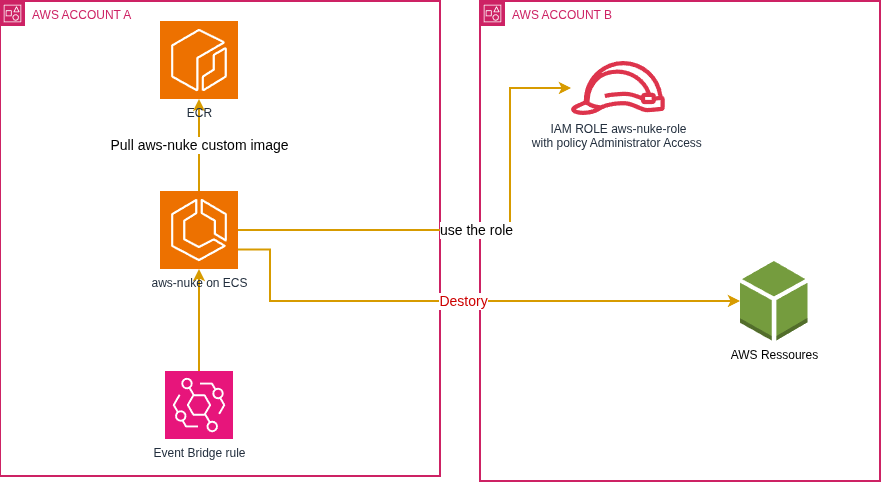

# Project purpose

Do you have AWS lab/test accounts and worry about leaving resources running and getting a huge bill? This project uses aws-nuke to help you delete all resources in target accounts on a schedule.

**WARNING: aws-nuke irreversibly deletes resources. Use only on disposable/test accounts and verify configuration before running.**

# Architecture

An ECS task running aws-nuke is triggered every midnight in AWS account A and deletes resources in a target account (AWS account B).



# Quickstart

1) Create an ECR repository in account A:

```
aws ecr create-repository \
    --repository-name aws-nuke \
    --region eu-west-1 --profile account-a
```

2) Build and push the Docker image to account A:

```
docker build . -t {account_a_id}.dkr.ecr.eu-west-1.amazonaws.com/aws-nuke:latest --no-cache
aws ecr --profile account-a get-login-password --region eu-west-1 | docker login --username AWS --password-stdin {account_a_id}.dkr.ecr.eu-west-1.amazonaws.com
docker push {account_a_id}.dkr.ecr.eu-west-1.amazonaws.com/aws-nuke:latest
```

3) Create IAM roles on the target accounts (accounts B, C, etc.):

Create an IAM role named `aws-nuke-role` in each target account with a trust policy that allows assume-role from account A. Then attach the AdministratorAccess policy to this role.

Example trust policy for the role:
```json
{
  "Version": "2012-10-17",
  "Statement": [
    {
      "Effect": "Allow",
      "Principal": {
        "AWS": "arn:aws:iam::{account_a_id}:root"
      },
      "Action": "sts:AssumeRole"
    }
  ]
}
```

4) Deploy with Terraform

```
terraform init
terraform apply  -var=aws_profile='account-a' -var='aws_region=eu-west-1' -var='SOURCE_ACCOUNT_ID={account_a_id}' -var='TARGET_ACCOUNT_IDS=["{account_b_id}","{account_c_id}"]'
```


# Cost 

With daily run of 10 minutes the estimated cost is ~$0.07/month

# Failed tasks notification:

To receive an email notification when AWS-NUKE fail, create AWS Eventbridge rule with the following event pattern and set SNS as target
```
{
  "source": ["aws.ecs"],
  "detail-type": ["ECS Task State Change"],
  "detail": {
    "desiredStatus": ["STOPPED"],
    "lastStatus": ["STOPPED"],
    "containers": {
      "exitCode": [{
        "anything-but": [0]
      }]
    }
  }
}
```


# Manual Invoke for testing

aws ecs run-task \
  --profile account-a \
  --cluster resource-cleanup-cluster \
  --task-definition resource-cleanup \
  --launch-type FARGATE \
  --network-configuration "awsvpcConfiguration={subnets=["$(terraform output -raw first_subnet_id)"
],securityGroups=["$(terraform output -raw security_group_id)"],assignPublicIp=ENABLED}" \
  --region "$(terraform output -raw aws_region)"


